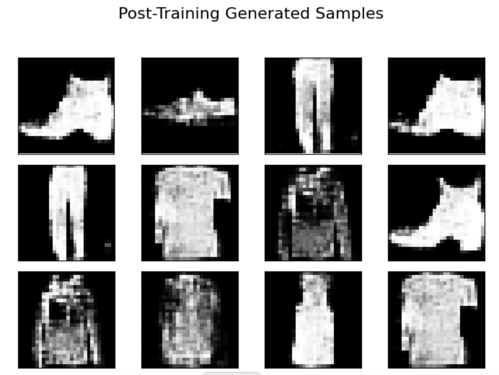
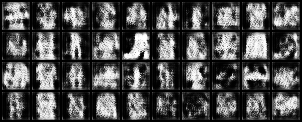
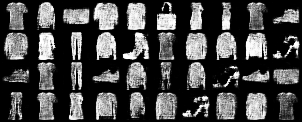
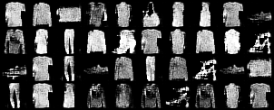

# cDCGAN-Trained-on-Fashion-MNIST-dataset

This repository contains a Contional Deep Convolutional Generative Adversarial Network (cDCGAN) implemented in PyTorch for generating images similar to the Fashion-MNIST dataset. It provides a flexible command-line interface for training and generating fashion-like images.

Below are some examples of how the generated samples look like post training




---

## Project Structure

```
fashion-mnist-gan/
├── data/
│   └── fashion-mnist_train.csv  
├── models/
│   ├── generator.py
│   └── discriminator.py
├── utils/
│   ├── data_loader.py
│   └── visualize.py
├── checkpoints/                 (This directory will be created during training)
│   └── generator_epoch_XXX.pth
│   └── discriminator_epoch_XXX.pth
├── results/                     (This directory will be created during training)
│   └── epoch_XXX.png
├── main.py     
├── train.py
├── generate.py
├── README.md
└── requirements.txt
```
---

## Setup

### 1. Clone the Repository

```bash
git clone https://github.com/Indiandude123/cDCGAN-on-fashion-mnist.git
cd cDCGAN-on-fashion-mnist
```

### 2. Prepare the Dataset

Download `fashion-mnist_train.csv` from a source like [Kaggle - Fashion MNIST Dataset](https://www.kaggle.com/datasets/zalando-research/fashionmnist) and place it inside the `data/` directory.

### 3. Create and Activate Virtual Environment (Recommended)

```bash
python -m venv venv
source venv/bin/activate  # On Windows: venv\Scripts\activate
```

### 4. Install Dependencies

```bash
pip install -r requirements.txt
```

---

## Usage

All functionality is accessed through the `main.py` interface.

---

### Training the GAN

To train the GAN:

```bash
python main.py train
```

### Available Training Arguments

| **Argument**         | **Type** | **Default** | **Description**                                                  |
|----------------------|----------|-------------|------------------------------------------------------------------|
| `--epochs`           | `int`    | `100`       | Total number of training epochs                                  |
| `--batch_size`       | `int`    | `128`       | Number of samples per training batch                             |
| `--num_steps_gen`    | `int`    | `1`         | Number of generator update steps per iteration                   |
| `--num_steps_disc`   | `int`    | `1`         | Number of discriminator update steps per iteration               |

> **Tip**: You can tune `--num_steps_gen` and `--num_steps_disc` to control how often the generator and discriminator are trained relative to each other. For example, `--num_steps_gen 3 --num_steps_disc 1` trains the generator three times for every discriminator update.


#### Examples:

```bash
# Train with default settings
python main.py train

# Train for 70 epochs with 3 generator steps per discriminator step
python main.py train --epochs 70 --num_steps_gen 3 --num_steps_disc 1

# Train using a custom batch size
python main.py train --batch_size 64
```

> Model checkpoints are saved in the `checkpoints/` directory.
> Generated images during training are saved in the `results/` directory.

---

### Generating Samples from a Trained Model

To generate samples from a trained generator model:

```bash
python main.py generate
```

#### Available Generation Arguments:

| Argument        | Type | Default                           | Description                               |
| --------------- | ---- | --------------------------------- | ----------------------------------------- |
| `--model_path`  | str  | `checkpoints/generator_final.pth` | Path to the trained generator `.pth` file |
| `--num_samples` | int  | 16                                | Number of samples to generate             |

#### Examples:

```bash
# Generate 25 samples from the final model
python main.py generate --num_samples 25

# Generate using a specific checkpoint
python main.py generate --model_path checkpoints/generator_epoch_100.pth
```

> Generated sample images will be saved inside the `results/` directory.

---


## Loss Function for Conditional DCGAN (cDCGAN)

The conditional DCGAN involves two deep convolutional neural networks:

- **G<sub>θ</sub>(z, y)**: Generator network, parameterized by θ. It generates an image conditioned on label `y` from a random noise `z`.
- **D<sub>w</sub>(x, y)**: Discriminator network, parameterized by `w`. It outputs the probability that image `x` is real, given label `y`.

Let:

- `x ~ p_data(x | y)`: Real data distribution conditioned on label `y`
- `z ~ p_z(z)`: Prior noise distribution (e.g., standard normal)
- `y ~ p(y)`: Distribution over class labels

---

### Minimax Objective:

The training process solves the following optimization problem:
min<sub>θ</sub> max<sub>w</sub> [
E<sub>(x | y) ~ p_data(x | y)</sub> [log D<sub>w</sub>(x, y)] +
E<sub>z ~ p<sub>z</sub>(z), y ~ p(y)</sub> [log(1 - D<sub>w</sub>(G<sub>θ</sub>(z, y), y))]
]

- The **Discriminator D<sub>w</sub>** learns to distinguish real vs. fake images, both conditioned on the label `y`.
- The **Generator G<sub>θ</sub>** learns to produce images that match the distribution of `p_data(x | y)` and fool the discriminator.

---

### Non-Saturating Generator Loss (Practical Alternative):

In practice, the generator is often trained using a non-saturating version of the loss to improve gradient flow:
min<sub>θ</sub> [E<sub>z ~ p<sub>z</sub>(z), y ~ p(y)</sub> [log D<sub>w</sub>(G<sub>θ</sub>(z, y), y)]]
This encourages the generator to produce class-conditional images that the discriminator classifies as real.


## Model Architecture

### Generator

* **Type**: Conditional Deep Convolutional Generator 
* **Input**: Random noise vector `z` concatenated with label embedding vector
* **Architecture**:
  - Linear layer → Reshape to `(256, 1, 1)`
  - 8 × ConvTranspose2D layers with:
    - Increasing spatial dimensions (up to 28×28)
    - BatchNorm + ReLU activations after each layer
  - Final Layer: `ConvTranspose2D(2 → 1)` with **Tanh** activation
* **Output**: `1 × 28 × 28` grayscale image normalized to `[-1, 1]`
* **Conditioning**: Label embedding learned via `nn.Embedding(num_classes, num_classes)`

---

### Discriminator

* **Type**: Conditional CNN based Binary Classifier
* **Input**: Real/generated image concatenated with label image
* **Architecture**:
  - Label Embedding → Linear → Reshape to `1 × 28 × 28`
  - Concatenate with input image → `2 × 28 × 28`
  - 3 × Conv2D layers:
    - Feature extraction (downsample to `1 × 1`)
    - BatchNorm + LeakyReLU after each layer
  - Flatten → Linear → **Sigmoid** activation
* **Output**: Scalar probability in `[0, 1]` (real or fake)
* **Conditioning**: Same label embedding mechanism as generator

---

## Generated Samples Over Epochs

Below are examples of generated images at different stages of training:

**Epoch 10**


**Epoch 50**


**Epoch 100**



## Dependencies

Key libraries used in this project:

* `torch`
* `torchvision`
* `matplotlib`
* `pandas`
* `numpy`
* `scikit-learn`
* `Pillow`

To install all dependencies:

```bash
pip install -r requirements.txt
```

---
